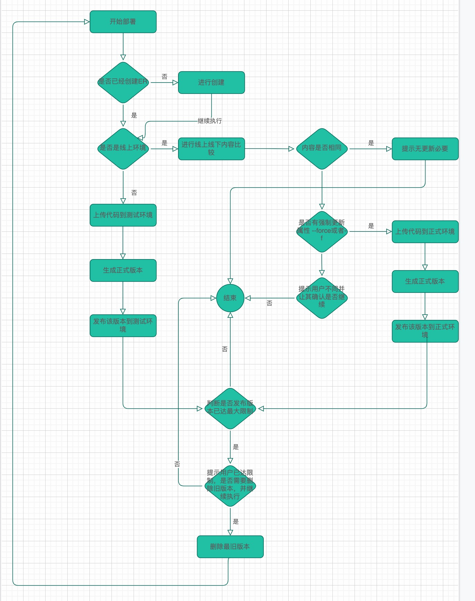

## ServerlessDevs Edgeroutine 组件介绍
ServerlessDevs Edgeroutine组件是一款基于ServerlessDevs的功能组件，他可以帮助您轻松将本地编写的js代码部署到阿里云边缘应用程序Edgeroutine上,并且提供了丰富的指令帮助您管理边缘应用程序。

### 特色
+ 支持本地化部署，最大程度的兼容您的开发习惯
+ 支持多环境部署，可以指定不同的配置文件作为不同环境或者脚本的部署配置
+ 支持自动发布记录删除，发布记录达上限是可以移除旧版本记录，保障发布成功
+ 支持持续集成，通过指令集成可以应用到您的CICD方案完成自动化构建

### 快速上手
#### 1.安装Serverless Devs工具
```bash
npm i @serverless-devs -g
```
#### 2.配置Serverless Devs秘钥信息
相关文档[查看](https://docs.serverless-devs.com/serverless-devs/default_provider_config/readme)
#### 3.初始化边缘应用程序模板
```bash
s init edgeroutine-bootstrap
```
如果已有er脚本，在er脚本同目录下请添加 s.yaml文件，参考内容如下：
```yaml
edition: 1.0.0        
name: edgeroutine-demo  #  项目名称
access: default # 密钥别名
services:
  edgeroutine:
    component: edgeroutine 
    props:
      erName: cms  # 你的edgeroutine应用程序名
      erDescription: 
      code: './websocketnew.js' #要上传的代码
      envConf:
        staging: '50ms'
        production: '100ms'
      envs:
        - production  #指定上传环境 

```
#### 执行部署
执行指令
```bash
s deploy
```

### 指令说明
#### 无配置文件操作edgeroutine
##### 查看Edgeroutine应用列表
```bash
s cli edgeroutine list 
```
##### 查看指定Edgeroutine代码
```bash
s cli edgeroutine [ername] [selectCodeRevision]
```

##### 删除指定Edgeroutine
```
s cli edgeroutine [ername]
```
#### 强制删除指定Edgeroutine(持续集成使用)
```
s cli edgeroutine [ername] --force|-f
```
#### 配置文件操作edgeroutine
##### 执行部署
直接在配置文件目录下执行
```bash
s deploy
```
或者指定配置文件
```
s deply -t [配置文件名]
```
### 配置文件参数

```yaml
erName: cms  # 你的edgeroutine应用程序名
erDescription: 
code: './edge.js' #要上传的代码
envConf:
  staging: '50ms'  #测试环境规格
  production: '100ms' #生产环境规格
envs:   #部署环境
  - production  #生产环境
  - staging   #测试环境
```

### 核心流程



